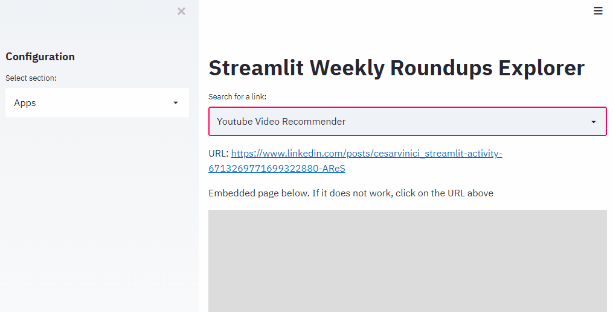

# Streamlit Weekly Roundup API

[](https://share.streamlit.io/andfanilo/streamlit-weekly-roundup-api/main/src/client.py)

Browse through all links from Streamlit Weekly Roundup [posts](https://discuss.streamlit.io/tag/weekly-roundup). _Also looking for an excuse to do a FastAPI/Streamlit app :)_



## Run

#### Download data

TODO

#### API

TODO

#### Streamlit app

```bash
streamlit run src/client.py
```

## Next steps

- Command to download data from [forum](https://discuss.streamlit.io) (though this would require an API key :sad:)
- Command to run a FastAPI server over a folder of data, or hitting the forum through an API key.
- Command to run Streamlit webapp over a folder of data, or hitting the FastAPI server.
